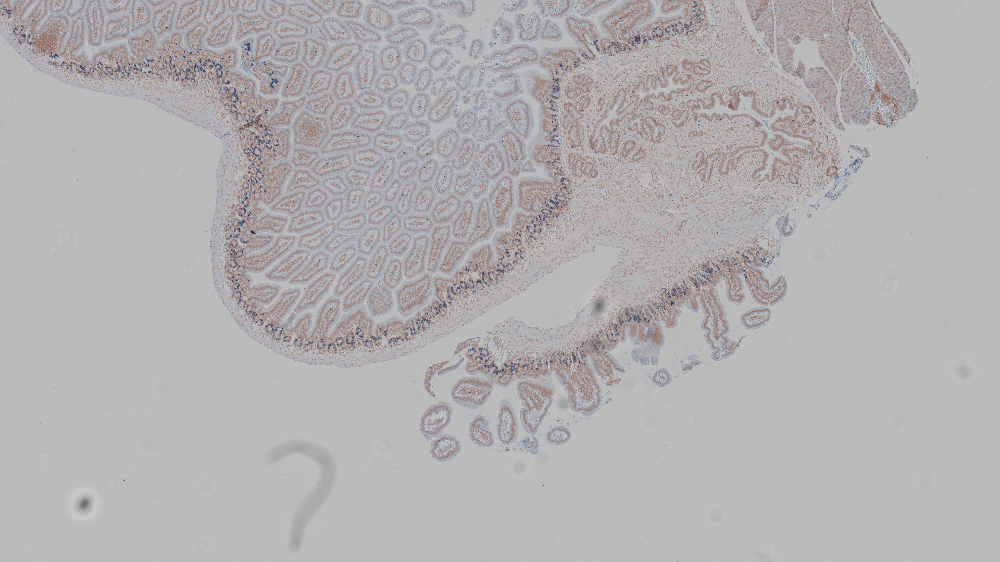

# Whole Slide Image (WSI) Viewer

Modern, interactive web application for viewing and analyzing whole slide microscopic images with advanced features for medical professionals and researchers.



## Features

- **Interactive WSI Viewing**: Pan and zoom capabilities for detailed image examination
- **Hub View**: Quick navigation with a minimap showing current viewing position
- **Cell Analysis**: Detailed breakdown of RBC, WBC, and Platelet counts
- **Report Generation**: Generate detailed reports from analysis data
- **Responsive Design**: Full-screen mode and collapsible side panel
- **Patient Information**: Display of patient ID and blood type

## Tech Stack

- React
- Typescript
- Tailwindcss
- Lucide React Icons

## Getting Started

### Prerequisites

- Nodejs (v18 or higher)
- npm or yarn

### Installation

1. Clone the repository:

```bash
git clone https://github.com/Revanth686/wsi-viewer.git
cd wsi-viewer
```

2. Install dependencies:

```bash
npm install
```

3. Start the development server:

```bash
npm run dev
```

The application will be available at `http://localhost:5173`

## Usage

### Navigation Controls

- **Pan**: Click and drag on main image
- **Zoom**: Use the zoom controls in the bottom right corner
- **Full Screen**: Toggle using the button in the top right
- **Side Panel**: Toggle using the arrow button on the panel edge

### Viewing Modes

- **Main View**: Large, interactive viewing area for detailed examination
- **Hub View**: Top-right minimap showing current position
- **Analysis Panel**: Left side panel showing cell counts and percentages

## Project Structure

```
src/
├── components/
│   ├── HubView.tsx     # Minimap navigation component
│   ├── MainViewer.tsx  # Primary image viewer
│   └── SidePanel.tsx   # Analysis data panel
├── context/
│   └── ViewerContext.tsx # Shared state management
└── App.tsx             # Main app component
```
